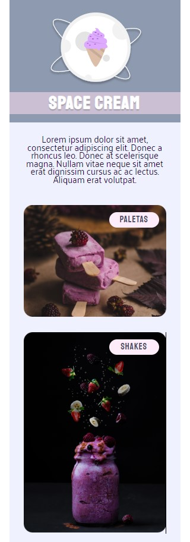

# spaceCream

<h1 align="center"> Space Cream</h1>

O projeto Space Cream foi desenvolvido durante o stage 03 no Explorer da Rocketseat. O proejto em questão trata-se de um desafio visando trabalhar com mobile-first.  

  

## 🚀 Tecnologias

Esse projeto foi desenvolvido com as seguintes tecnologias:

- HTML e CSS
- Git e Github
- Figma

[Acesse o projeto finalizado, online](https://marcelgava.github.io/spaceCream/)
